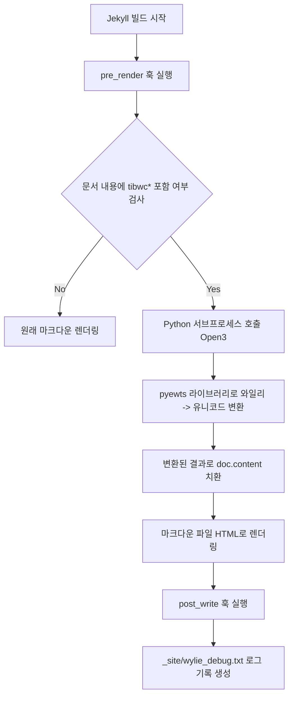

이 블로그와 이 문서는 Antigravity를 통해 만들었다. 아래 내용은 대부분 Antigravity가 작성한 내용이다.

---
이 문서는 블로그 포스트 작성 시 티베트어 와일리(Wylie) 표기법을 티베트 문자(유니코드)로 자동 변환하는 방법과, 이를 처리하는 백엔드 플러그인 `wylie_converter.rb` 의 동작 원리를 다룹니다.

---

## 1. 문서 작성 시 와일리 변환 가이드

블로그에 티베트 문자를 입력할 때는 직접 유니코드를 타이핑하는 대신, 라틴 문자를 기반으로 한 **EWTS(Extended Wylie Transliteration Scheme)** 표기법을 사용하여 편리하게 작성할 수 있습니다. 

### 1.1 작성 방법 및 문법
본문에 티베트어로 변환하고자 하는 와일리 텍스트를 `tibwc*[와일리 텍스트]*` 패턴으로 감싸서 작성합니다. 
* **기본 형식**: `tibwc*wylie_text*`
* **변환 결과**: 빌드 시 자동으로 `[티베트 유니코드] *[와일리 텍스트]*` 형식으로 변환됩니다. (마크다운 문법에서 `**`는 이탤릭체 변환)

### 1.2 대표적인 표기 예시
| 입력 양식 | 변환 결과 (유니코드 + 와일리) | 설명 |
| :--- | :--- | :--- |
| `tibwc*bod*` | བོད་ *bod* | 티베트(Bod)를 나타내는 가장 기본적인 단어 |
| `tibwc*bkra shis bde legs*` | བཀྲ་ཤིས་བདེ་ལེགས་ *bkra shis bde legs* | 티베트어 인사말 (따시델렉) |
| `tibwc*bKa' 'gyur*` | བཀའ་འགྱུར་ *bKa' 'gyur* | 대장경(깐규르)
| `tibwc*chos /*` | ཆོས་། *chos /* | 구두점 *shad*(།) 뒤에 공백이 있는 경우 |
| `tibwc*chos/*` | ཆོས། *chos/* | 단어 바로 뒤에 *shad*(།)이 붙는 경우 |

### 1.3 작성 시 주의사항
1. **대소문자 구분**: 확장 와일리 표기법은 대소문자를 엄격히 구분합니다.
2. **띄어쓰기**: 티베트어 음절을 구분하는 *tsheg*(་)은 와일리 표기 상의 **공백(Space)**으로 변환됩니다.
3. **구두점**: 티베트어 문장의 마침표 역할을 하는 *shad*(།)은 슬래시(`/`)로 입력합니다.

---

## 2. 와일리 변환 과정의 기술적 동작 원리

이 블로그는 Jekyll 빌드 시 실행되는 커스텀 루비 플러그인을 활용하여 실시간으로 와일리 표기를 티베트 문자로 치환합니다.

### 2.1 전체 아키텍처 및 데이터 흐름



### 2.2 핵심 구성 요소

#### 1) Jekyll pre_render Hook `wylie_converter.rb`
Jekyll이 각 마크다운 파일을 HTML로 변환하기 전(`pre_render` 단계)에 문서 내부의 텍스트를 스캔합니다.
* 확장자가 `.md` 또는 `.markdown`인 파일에 한해 동작합니다.
* 텍스트 내에 `tibwc*` 키워드가 감지되면, 해당 문서의 내용(`doc.content`)을 표준 입력(stdin)으로 하여 외부 Python 스크립트를 호출합니다.

#### 2) Python 서브프로세스 및 `pyewts` 라이브러리
변환의 핵심 로직은 Python의 `pyewts` 라이브러리를 통해 처리됩니다.
* **인코딩 문제 방지**: Windows 환경에서 한글 및 티베트어 문자가 깨지는 것을 막기 위해 `PYTHONUTF8=1` 환경변수를 설정하고, Python의 표준 입출력을 UTF-8로 지정합니다.
* **정규식 치환**: 정규표현식 `tibwc\*(.*?)\*`를 사용하여 패턴을 찾아낸 뒤, 매칭된 텍스트(`m.group(1)`)를 `converter.toUnicode()`로 변환하여 병렬 치환합니다.
  ```python
  result = re.sub(r"tibwc\*(.*?)\*", lambda m: f"{converter.toUnicode(m.group(1))} *{m.group(1)}*", text)
  ```

#### 3) 디버깅 로그 시스템
Jekyll 빌드가 종료되는 시점(`post_write` 단계)에 전체 문서의 변환 과정 및 처리 결과 로그를 모아 `_site/wylie_debug.txt` 파일로 작성합니다. 이를 통해 변환 오류가 발생했을 때 로그 파일에서 상세한 에러 메시지와 흐름을 추적할 수 있습니다.
